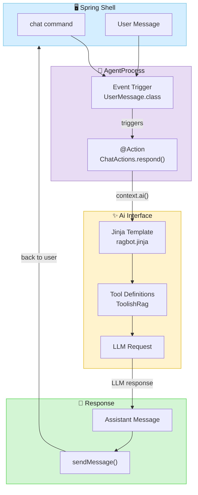
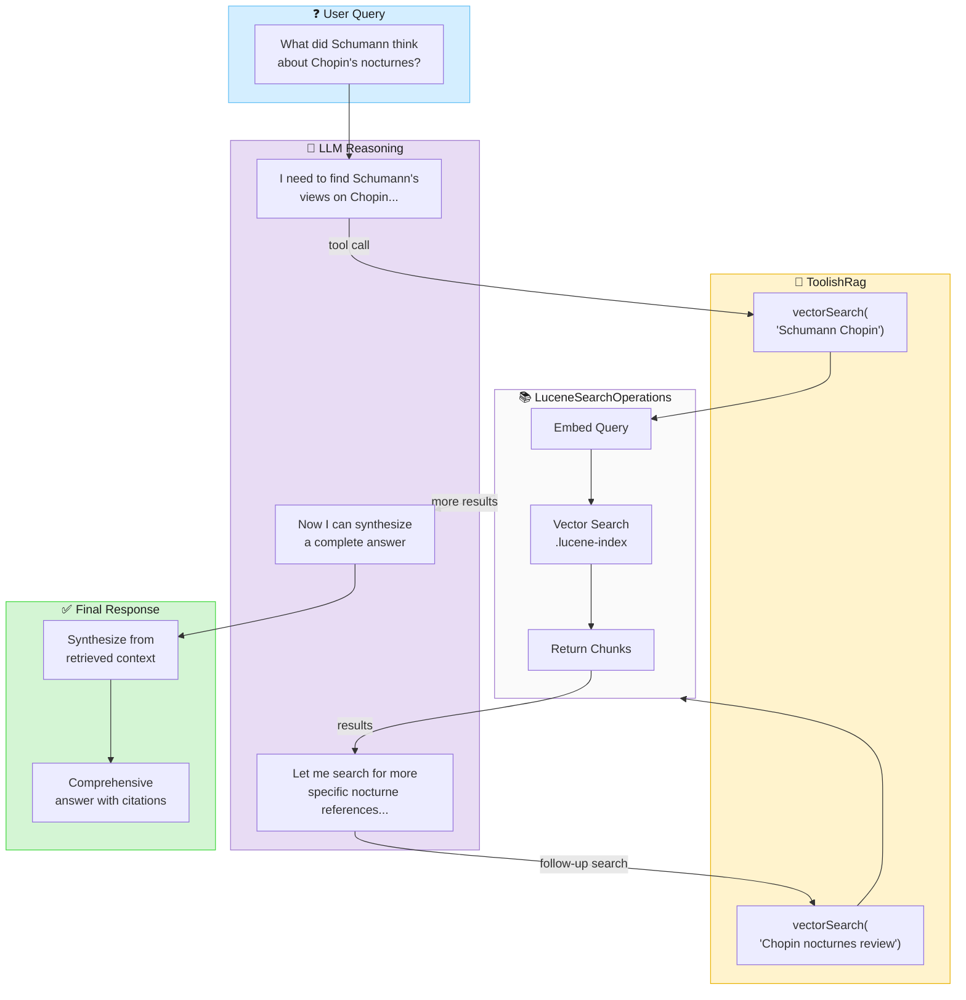

&nbsp;&nbsp;&nbsp;&nbsp;

&nbsp;&nbsp;&nbsp;&nbsp;

# Ragbot - RAG-Powered Chatbot Example

This project demonstrates Retrieval-Augmented Generation (RAG) using Embabel Agent with Apache Lucene for vector storage
and Spring Shell or a simple [Javelit](https://javelit.io/) UI for interaction.

## Getting Started

### Prerequisites

**API Key**: Set at least one LLM provider API key as an environment variable:

```bash
# For OpenAI (GPT models)
export OPENAI_API_KEY=sk-...

# For Anthropic (Claude models)
export ANTHROPIC_API_KEY=sk-ant-...
```

The model configured in `application.yml` determines which key is required. The default configuration uses OpenAI.

**Java**: Java 21+ is required.

### Quick Start

1. Set your API key (see above)
2. Run the shell:
   ```bash
   ./scripts/shell.sh
   ```
3. Ingest the default document ([Robert Schumann](https://en.wikipedia.org/wiki/Robert_Schumann)'s music criticism):
   ```
   ingest
   ```
4. Optionally, ingest [Philip Hale](https://en.wikipedia.org/wiki/Philip_Hale_(critic))'s Boston Symphony program notes for cross-source comparison:
   ```
   ingest https://www.gutenberg.org/files/56208/56208-h/56208-h.htm
   ```
5. Start chatting. Change the port if you wish:
   ```
   uichat 8888
   ```

### Why Old Music Criticism?

While you can ingest any content into this RAG app, the default content is historical music criticism: [Robert Schumann](https://en.wikipedia.org/wiki/Robert_Schumann)'s writings (1830s-1850s) and [Philip Hale](https://en.wikipedia.org/wiki/Philip_Hale_(critic))'s Boston Symphony program notes (early 1900s). This choice is deliberate: **obscure historical content ensures the LLM must actually use RAG** rather than relying on general knowledge. _Also, Rod Johnson has a PhD in musicology and loves this stuff._

If you ingested Wikipedia articles about Java or common tech topics, the LLM could answer most questions from its training data alone, making it hard to verify that RAG is working. With Schumann's opinions on Chopin's nocturnes or Hale's commentary on Meyerbeer, the LLM has no choice but to search the indexed content - giving you clear evidence that retrieval is happening.

**Example questions to try:**

```
# Single-source questions
What did Schumann think about Liszt?
What did Philip Hale think about Liszt?
What does Schumann say about Chopin's nocturnes?

# Cross-source comparison (requires ingesting both sources)
Compare Hale and Schumann's opinions of Liszt
```

These questions demonstrate agentic RAG in action - the LLM will make multiple searches, synthesize information across chunks, and cite specific passages from the criticism.

## Usage

Run the shell script to start Embabel under Spring Shell:

```bash
./scripts/shell.sh
```

You can also run the main class, `com.embabel.examples.ragbot.RagShellApplication`, directly from your IDE.

### Shell Commands

| Command                   | Description                                                                                                                                                                                                                                                   |
|---------------------------|---------------------------------------------------------------------------------------------------------------------------------------------------------------------------------------------------------------------------------------------------------------|
| `ingest [url]`            | Ingest a URL or file into the RAG store. Uses Apache Tika to parse content hierarchically and chunks it for vector storage. Defaults to Schumann's music criticism. Documents are only ingested if they don't already exist.  |
| `ingest-directory <path>` | Ingest all markdown (`.md`) and text (`.txt`) files from a directory recursively. Useful for loading preprocessed content from docling or other sources.                                                                                                      |
| `zap`                     | Clear all documents from the Lucene index. Returns the count of deleted documents.                                                                                                                                                                            |
| `chunks`                  | Display all stored chunks with their IDs and content. Useful for debugging what content has been indexed.                                                                                                                                                     |
| `chat`                    | Start an interactive chat session where you can ask questions about ingested content.                                                                                                                                                                         |
| `uichat [port]`           | Launch a web-based chat UI using [Javelit](https://javelit.io). Opens at http://localhost:8888 by default. Use `uichat-stop` to stop.                                                                                                                         |
| `info`                    | Show Lucene store info: number of chunks, index size, etc.                                                                                                                                                                                                    |

### Web Chat UI

The `uichat` command launches a browser-based chat interface built with [Javelit](https://javelit.io):


### Example Workflow

```bash
# Start the shell
./scripts/shell.sh

# Ingest the default document (Schumann's music criticism)
ingest

# Or ingest Philip Hale's Boston Symphony program notes
ingest https://www.gutenberg.org/files/56208/56208-h/56208-h.htm

# View what was indexed
chunks

# Chat with the RAG-powered assistant
chat
> What does this document say about X?

# Clear the index when done
zap
```

## Troubleshooting

### No Output in Chat

If you're not seeing LLM responses in the chat session, the output may be redirected to a log file. Set `redirect-log-to-file` to `false` in `application.yml`:

```yaml
embabel:
  agent:
    shell:
      redirect-log-to-file: false
```

Alternatively, you can tail the log file in a separate terminal to see output:

```bash
tail -f logs/chat-session.log
```

### Poor Quality RAG Results

First, check the state of the Lucene index by running the `info` command in the shell.
If you do have content, run the `chunks` command to see what has been indexed.

If ingested content is present but you're seeing poor results, it may be that the source was in a format (like complex HTML) that didn't parse cleanly. Consider using [docling](#preprocessing-with-docling) to convert complex documents to clean markdown before ingestion.

You may also want to adjust chunking parameters in `application.yml` to better suit your content:

```yaml
ragbot:
  chunker-config:
    max-chunk-size: 800      # Increase for longer chunks
    overlap-size: 100        # Increase for more context overlap
``` 

## Implementation

### Chatbot with Utility Actions

The chatbot uses Embabel's **utility pattern** - a streamlined approach where `@Action` methods respond to conversation events without complex goal planning. This is ideal for chatbots where the flow is straightforward: user sends message → system responds.



**Key Concepts:**

- **Utility Pattern**: `AgentProcessChatbot.utilityFromPlatform()` creates a chatbot that auto-discovers `@Action` methods
- **Trigger-based**: `@Action(trigger = UserMessage.class)` fires on each user message
- **Fluent AI Builder**: `context.ai().withLlm(...).withReference(toolishRag).withTemplate(...)` builds the request

### Agentic RAG

The RAG system is **agentic** - the LLM autonomously decides when and how to search, potentially making multiple tool calls to gather comprehensive information before responding.



**Agentic Capabilities:**

1. **Autonomous Search**: LLM decides when to call `vectorSearch()` based on the question
2. **Iterative Refinement**: Can make multiple searches, using results to inform follow-up queries
3. **Context Synthesis**: Combines information from multiple chunks into coherent responses
4. **Citation Awareness**: References specific sources from the retrieved content

**Flow Summary:**

1. User types `chat` → **AgentProcess** starts and manages the session
2. User sends a message → triggers `@Action(trigger = UserMessage.class)`
3. **ChatActions.respond()** builds request via **Ai** interface, adding **ToolishRag** with `.withReference()`
4. **Ai** packages prompt + tool definitions, sends to LLM
5. **LLM** autonomously decides to call **ToolishRag** tools to search for relevant content
6. The **ToolishRag** tool queries Lucene index, returns matching chunks to LLM
7. **LLM** may make additional searches based on initial results
8. **LLM** generates response using all retrieved context → sent back to user
9. Loop continues for each new message until user exits

### RAG Configuration

RAG is configured in [`RagConfiguration.java`](./src/main/java/com/embabel/examples/ragbot/RagConfiguration.java):

```java

@Bean
LuceneSearchOperations luceneSearchOperations(
        ModelProvider modelProvider,
        RagbotProperties properties) {
    var embeddingService = modelProvider.getEmbeddingService(DefaultModelSelectionCriteria.INSTANCE);
    var luceneSearchOperations = LuceneSearchOperations
            .withName("docs")
            .withEmbeddingService(embeddingService)
            .withChunkerConfig(properties.chunkerConfig())
            .withIndexPath(Paths.get("./.lucene-index"))
            .buildAndLoadChunks();
    return luceneSearchOperations;
}
```

Key aspects:

- **Lucene with disk persistence**: The vector index is stored at `./.lucene-index`, surviving application restarts
- **Embedding service**: Uses the configured `ModelProvider` to get an embedding service for vectorizing content
- **Configurable chunking**: Content is split into chunks with configurable size (default 800 chars), overlap (default
  50 chars), and optional section title inclusion

Chunking properties can be configured via `application.yml`:

```yaml
ragbot:
  chunker-config:
    max-chunk-size: 800
    overlap-size: 100
```

### Chatbot Creation

The chatbot is created in [
`ChatConfiguration.java`](./src/main/java/com/embabel/examples/ragbot/ChatConfiguration.java):

```java

@Bean
Chatbot chatbot(AgentPlatform agentPlatform) {
    return AgentProcessChatbot.utilityFromPlatform(agentPlatform);
}
```

The `AgentProcessChatbot.utilityFromPlatform()` method creates a chatbot that automatically discovers all `@Action`
methods in `@EmbabelComponent` classes. Any action with a matching trigger becomes eligible to be called when
appropriate messages arrive.

### Action Handling

Chat actions are defined in [`ChatActions.java`](./src/main/java/com/embabel/examples/ragbot/ChatActions.java):

```java

@EmbabelComponent
public class ChatActions {

    private final ToolishRag toolishRag;
    private final RagbotProperties properties;

    public ChatActions(SearchOperations searchOperations, RagbotProperties properties) {
        this.toolishRag = new ToolishRag(
                "sources",
                "Sources for answering user questions",
                searchOperations);
        this.properties = properties;
    }

    @Action(canRerun = true, trigger = UserMessage.class)
    void respond(Conversation conversation, ActionContext context) {
        var assistantMessage = context.ai()
                .withLlm(properties.chatLlm())
                .withReference(toolishRag)
                .withTemplate("ragbot")
                .respondWithSystemPrompt(conversation, Map.of(
                        "properties", properties
                ));
        context.sendMessage(conversation.addMessage(assistantMessage));
    }
}
```

Key concepts:

1. **`@EmbabelComponent`**: Marks the class as containing agent actions that can be discovered by the platform

2. **`@Action` annotation**:
    - `trigger = UserMessage.class`: This action is invoked whenever a `UserMessage` is received in the conversation
    - `canRerun = true`: The action can be executed multiple times (for each user message)

3. **`ToolishRag` as LLM reference**:
    - Wraps the `SearchOperations` (Lucene index) as a tool the LLM can use
    - When `.withReference(toolishRag)` is called, the LLM can search the RAG store to find relevant content
    - The LLM decides when to use this tool based on the user's question

4. **Response flow**:
    - User sends a message (triggering the action)
    - The action builds an AI request with the RAG reference
    - The LLM may call the RAG tool to retrieve relevant chunks
    - The LLM generates a response using retrieved context
    - The response is added to the conversation and sent back

### Prompt Templates

Chatbot prompts are managed using Jinja templates rather than inline strings. This is best practice for chatbots
because:

- **Prompts grow complex**: Chatbots require detailed system prompts covering persona, guardrails, objectives, and
  behavior guidelines
- **Separation of concerns**: Prompt engineering can evolve independently from Java code
- **Reusability**: Common elements (guardrails, personas) can be shared across different chatbot configurations
- **Configuration-driven**: Switch personas or objectives via `application.yml` without code changes

#### Separating Voice from Objective

The template system separates two concerns:

- **Objective**: *What* the chatbot should accomplish - the task-specific instructions and domain expertise (e.g.,
  analyzing legal documents, answering technical questions)
- **Voice**: *How* the chatbot should communicate - the persona, tone, and style of responses (e.g., formal lawyer,
  Shakespearean, sarcastic)

This separation allows mixing and matching. You could have a "legal" objective answered in the voice of Shakespeare,
Monty Python, or a serious lawyer - without duplicating the legal analysis instructions in each persona template.

#### Template Structure

```
src/main/resources/prompts/
├── ragbot.jinja                    # Main template entry point
├── elements/
│   ├── guardrails.jinja            # Safety and content restrictions
│   └── personalization.jinja       # Dynamic persona/objective loader
├── personas/                       # HOW to communicate (voice/style)
│   ├── clause.jinja                # Serious legal expert
│   ├── shakespeare.jinja           # Elizabethan style
│   ├── monty_python.jinja          # Absurdist humor
│   └── ...
└── objectives/                     # WHAT to accomplish (task/domain)
    └── legal.jinja                 # Legal document analysis
```

#### How Templates Are Loaded

The main template `ragbot.jinja` composes the system prompt from reusable elements:

```jinja



```

The `personalization.jinja` template dynamically includes persona and objective based on configuration:

```jinja





```

#### Invoking Templates from Code

Templates are invoked using `.withTemplate()` and passing bindings:

```java
context.ai()
    .withLlm(properties.chatLlm())
    .withReference(toolishRag)
    .withTemplate("ragbot")
    .respondWithSystemPrompt(
            conversation, 
         Map.of(
            "properties", properties
    ));
```

The `properties` object (a Java record) is accessible in templates. Jinjava supports calling record accessor methods
with `properties.voice().persona()` syntax for nested records.

To create a new persona, add a `.jinja` file to `prompts/personas/` and reference it by name in `application.yml`.
See [Configuration Reference](#configuration-reference) for all available settings.

### Creating a Custom Objective and Persona

This section walks through creating a new chatbot configuration from scratch, using a music critic example.

#### Step 1: Create the Objective Template

The objective defines *what* the chatbot should accomplish. Create a new file at:

```
src/main/resources/prompts/objectives/music.jinja
```

Example content based on existing objectives:

```jinja
Answer questions about classical music and music history in a clear and engaging manner.

The tools available to you access a curated collection of music criticism and program notes.
You must always use these tools to find answers, as your general knowledge will not extend to everything in the collection
and these tools allow you to find detailed analysis if you try hard enough.

Always back up your points with direct quotes from the music criticism sources.

You may find that the result from one tool call leads to a search for another tool,
e.g. a result mentioning "as discussed in the review of Chopin's nocturnes..." might lead to a search for "Chopin nocturnes".

DO NOT RELY ON GENERAL KNOWLEDGE unless you are certain a better answer is not in the provided sources.
```

#### Step 2: Create the Persona Template

The persona defines *how* the chatbot communicates. Create a new file at:

```
src/main/resources/prompts/personas/music-guide.jinja
```

Example content based on existing personas:

```jinja
Your name is Maestro.
You are a passionate music critic with deep knowledge of classical music history.
You want to share your love of music with others and help them appreciate the art of composition.
You speak with enthusiasm about harmony, orchestration, and musical interpretation.
```

#### Step 3: Update the Directory Structure

After creating the files, your prompts directory should look like:

```
src/main/resources/prompts/
├── ragbot.jinja
├── elements/
│   ├── guardrails.jinja
│   └── personalization.jinja
├── personas/
│   ├── clause.jinja
│   ├── music-guide.jinja          # NEW
│   └── ...
└── objectives/
    ├── legal.jinja
    ├── music.jinja                 # NEW
    └── ...
```

#### Step 4: Update ChatActions with ToolishRag Description

The `ToolishRag` description in `ChatActions.java` helps the LLM understand what content is available. Update the constructor to describe your new content:

```java
public ChatActions(
        SearchOperations searchOperations,
        RagbotProperties properties) {
    this.toolishRag = new ToolishRag(
            "sources",
            "Music criticism and program notes: Historical perspectives on classical music",  // Updated description
            searchOperations)
            .withHint(TryHyDE.usingConversationContext());
    this.properties = properties;
}
```

The description should briefly explain what content the RAG store contains, helping the LLM make better decisions about when and how to search.

#### Step 5: Ingest Your Content

Use the `ingest` command to load content:

```bash
# Start the shell
./scripts/shell.sh

# Ingest Schumann's music criticism (default)
ingest

# Ingest Philip Hale's Boston Symphony program notes
ingest https://www.gutenberg.org/files/56208/56208-h/56208-h.htm

# Verify content was indexed
chunks
```

You can also use `ingest-directory` to load a directory of markdown or text files for larger collections.

#### Step 6: Configure application.yml

Finally, update your configuration to use the new objective and persona:

```yaml
ragbot:
  voice:
    persona: music-guide           # References personas/music-guide.jinja
    max-words: 50

  objective: music                 # References objectives/music.jinja

  chat-llm:
    model: gpt-4.1-mini
    temperature: 0.3               # Slightly creative for engaging music discussion
```

#### Complete Example Summary

| File | Purpose |
|------|---------|
| `prompts/objectives/music.jinja` | Defines the task: answering questions about music |
| `prompts/personas/music-guide.jinja` | Defines the voice: enthusiastic music expert |
| `ChatActions.java` (constructor) | Describes the RAG content for the LLM |
| `application.yml` | Wires everything together |

Restart the application after making these changes:

## Configuration Reference

All configuration is externalized in `application.yml`, allowing behavior changes without code modifications.

### application.yml Reference

```yaml
ragbot:
  # RAG chunking settings
  chunker-config:
    max-chunk-size: 800      # Maximum characters per chunk
    overlap-size: 100        # Overlap between chunks for context continuity

  # LLM model selection and hyperparameters
  chat-llm:
    model: gpt-4.1-mini      # Model to use for chat responses
    temperature: 0.0         # 0.0 = deterministic, higher = more creative

  # Voice controls HOW the chatbot communicates
  voice:
    persona: clause          # Which persona template to use (personas/*.jinja)
    max-words: 30            # Hint for response length

  # Objective controls WHAT the chatbot accomplishes
  objective: legal           # Which objective template to use (objectives/*.jinja)

embabel:
  agent:
    shell:
      # Redirect logging during chat sessions
      redirect-log-to-file: true
```

### Logging During Chat Sessions

When `redirect-log-to-file: true`, console logging is redirected to a file during chat sessions, providing a cleaner
chat experience. Logs are written to:

```
logs/chat-session.log
```

To monitor logs while chatting, open a separate terminal and tail the log file:

```bash
tail -f logs/chat-session.log
```

This is useful for debugging RAG retrieval, seeing which chunks are being returned, and monitoring LLM API calls.

### Switching Personas and Models

To change the chatbot's personality, simply update the `persona` value:

```yaml
ragbot:
  voice:
    persona: shakespeare     # Now responds in Elizabethan English
```

To use a different LLM:

```yaml
ragbot:
  chat-llm:
    model: gpt-4.1           # Use the larger GPT-4.1 instead
    temperature: 0.7         # More creative responses
```

No code changes required - just restart the application.

## Preprocessing with docling

[Docling](https://www.docling.ai) is a document conversion tool that excels at converting complex formats (PDF, Word, HTML, PowerPoint) to clean markdown. This is useful when source documents don't parse well with standard tools.

**Note:** Docling can be slow, especially for large or complex documents. Plan accordingly.

### Installation

You'll need Python. It's good practice to set up a virtual environment first:

```bash
# Using venv (Python standard library)
python -m venv docling-env
source docling-env/bin/activate  # On Windows: docling-env\Scripts\activate

# Or using conda
conda create -n docling python=3.11
conda activate docling
```

Then install docling:

```bash
pip install docling
```

### Usage

Convert a single file to markdown:

```bash
docling document.pdf --to md --output output_dir/
```

Convert all files in a directory:

```bash
docling input_dir/ --to md --output output_dir/
```

### When to Use docling

- PDF documents with complex layouts, tables, or images
- HTML pages that don't parse cleanly with Tika
- Word documents with formatting that needs preservation
- Any document where the default ingestion produces poor chunking

After converting to markdown, use `ingest-directory` to load the cleaned content:

```bash
ingest-directory output_dir/
```

See the [Docling documentation](https://docling-project.github.io/docling/) for more options and advanced usage.

## References

### Embabel Agent Documentation

- [Building a Chatbot](https://docs.embabel.com/embabel-agent/guide/0.3.3-SNAPSHOT/#building-a-chatbot) - Complete guide to creating chatbots with Embabel Agent
- [Utility AI](https://docs.embabel.com/embabel-agent/guide/0.3.3-SNAPSHOT/#reference.planners__utility) - The utility pattern used in this demo for trigger-based actions
- [RAG Reference](https://docs.embabel.com/embabel-agent/guide/0.3.3-SNAPSHOT/#reference.rag) - Retrieval-Augmented Generation with Embabel

### GitHub Repositories

- [embabel-agent](https://github.com/embabel/embabel-agent) - The core Embabel Agent framework
- [java-agent-template](https://github.com/embabel/java-agent-template) - Template for starting new Embabel Agent projects
